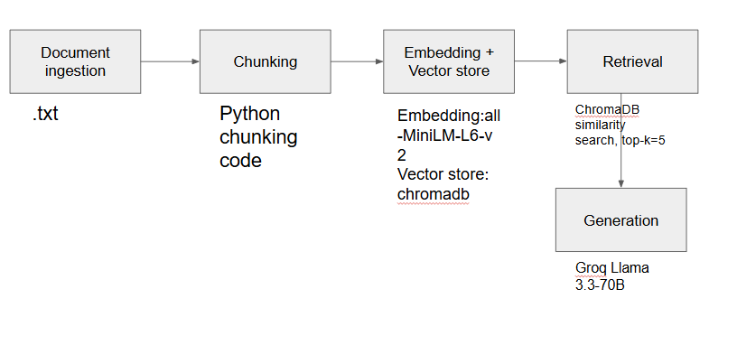

# Project 1 Planning: The Unofficial Guide

> Write this document before you write any pipeline code.
> Your spec and architecture diagram are what you'll use to direct AI tools (Claude, Copilot, etc.) to generate your implementation — the more specific they are, the more useful the generated code will be.
> Update the Retrieval Approach and Chunking Strategy sections if you change your approach during implementation.
> Update this file before starting any stretch features.

---

## Domain

<!-- What domain did you choose? Why is this knowledge valuable and hard to find through official channels? -->
I am choosing CS professor at UTD domain since there is a lot of information to compare with such as UTDGrades and trends. There is also rate my professor and reddits. Since there are many resources, it is easier to paint a better picture for the user and consolidate it. It is difficult through official channels since they can be biased, so using the student created tools and experiences is the best way to share perspectives.
---

## Documents

<!-- List your specific sources: URLs, subreddit names, forum threads, or file descriptions.
     Aim for at least 10 sources that together cover different subtopics or perspectives within your domain. -->

| # | Source | Description | URL or location |
|---|--------|-------------|-----------------|
| 1 |UTDGrades|Shows the grades and ratings of professors at UTD (this is one specific UTD prof) 1337 |https://www.utdgrades.com/results?search=CS+1337&sectionId=24518|
| 2 |UTD Grades|Shows the grades and ratings of professors at UTD (this is one specific UTD prof) different 1337 professor |https://www.utdgrades.com/results?search=CS+1337&sectionId=52085 |
| 3 |UTD Trends |Shows the grades and ratings of professors at UTD (this is for a course) 3354 |https://trends.utdnebula.com/dashboard?searchTerms=CS+3354&availability=26F|
| 4 |UTD Trends |Shows the grades and ratings of professors at UTD (this is for a course) 4391 |https://trends.utdnebula.com/dashboard?searchTerms=CS+4391&availability=26F|
| 5 |Reddit |UTD Thread |https://www.reddit.com/r/utdallas/comments/tzuzbm/best_cs_professors/ |
| 6 |Reddit |UTD Thread a different one |https://www.reddit.com/r/utdallas/comments/1sfeu7k/advice_on_cs_3341_cs_2336_and_cs_2340_professors/ |
| 7 |Coursicle |A specific UTD Professor in this link |https://www.coursicle.com/utdallas/professors/Simeon+Ntafos/ |
| 8 |Coursicle |A different UTD Professor |https://www.coursicle.com/utdallas/professors/Gopal+Gupta/ |
| 9 |Rate My Professor |Ratings and review about a CS UTD Prof |https://www.ratemyprofessors.com/professor/1833058 |
| 10|Rate My Professor |Ratings and review about a CS UTD Prof |https://www.ratemyprofessors.com/professor/1554657 |

---

## Chunking Strategy

<!-- How will you split documents into chunks?
     State your chunk size (in tokens or characters), overlap size, and explain why those
     numbers fit the structure of your documents.
     A review-heavy corpus warrants different chunking than a long FAQ. -->

**Chunk size:** 250

**Overlap:** 25

**Reasoning:** I am choosing around 250 characters because a lot of the sources have only around couple sentences. Some have longer but the majority has smaller amounts, so 250 characters is a good choice. I choose overlap of 25 because the characters and posts are relatively small but having some overlap could help, so I chose a relatively small size.

---

## Retrieval Approach

<!-- Which embedding model are you using (e.g., all-MiniLM-L6-v2 via sentence-transformers)?
     How many chunks will you retrieve per query (top-k)?
     If you were deploying this for real users and cost wasn't a constraint, what tradeoffs
     would you weigh in choosing a different embedding model — context length, multilingual
     support, accuracy on domain-specific text, latency? -->

**Embedding model:** all-MiniLM-L6-v2 via sentence-transformers due to the simplicity and light weight nature of this model.

**Top-k:** Around 5 since a lot of the sources lean specific, so having the top 5 chunks be retrieved is ideal. This should provide the LLM with enough context but not too much as to affect performance and quality.

**Production tradeoff reflection:** I would choose accuracy and latency to improve performance but also sort of adjust chunking approaches depending on the source since some sources are going to be shorter than others. Accuracy would be the biggest thing and I would try to incorporate semantic search and various chunking strategies for different documents. Latency is important for getting fast results so that would be another main thing I would focus on. 

---

## Evaluation Plan

<!-- List your 5 test questions with their expected correct answers.
     Questions should be specific enough that you can judge whether the system's response
     is right or wrong. "What are good dining halls?" is too vague.
     "What do students say about wait times at [dining hall name] during lunch?" is testable. -->

| # | Question | Expected answer |
|---|----------|-----------------|
| 1 |Who is the best teacher for CS 2340?|Varied but answers should have Alice Wang. |
| 2 |How is Gopal Gupta's teaching style? |More on the mid side, okay. |
| 3 |Who is the best CS professor? |The answer should explain that this is subjective and depends on the sources, but Reddit comments mention certain professors positively rather than giving one universal best professor. |
| 4 |How is Simeon Ntafos |Mostly negative |
| 5 |What are the grades for 3354 like? |A/A- |

---

## Anticipated Challenges

<!-- What could go wrong? Name at least two specific risks with reasoning.
     Consider: noisy or inconsistent documents, missing source attribution, off-topic
     retrieval, chunks that split key information across boundaries. -->

1.Student opinions may contradict each other because Reddit, RMP, and Coursicle reviews reflect different personal experiences.

2.Some Reddit threads discuss multiple professors and courses in one place, so 250-character chunks may split context or retrieve only part of the discussion.

---

## Architecture

<!-- Draw a diagram of your pipeline showing the five stages:
     Document Ingestion → Chunking → Embedding + Vector Store → Retrieval → Generation
     Label each stage with the tool or library you're using.
     You can use ASCII art, a Mermaid diagram, or embed a sketch as an image.
     You'll use this diagram as context when prompting AI tools to implement each stage. -->
     

---

## AI Tool Plan

<!-- For each part of the pipeline below, describe:
     - Which AI tool you plan to use (Claude, Copilot, ChatGPT, etc.)
     - What you'll give it as input (which sections of this planning.md, which requirements)
     - What you expect it to produce
     - How you'll verify the output matches your spec

     "I'll use AI to help me code" is not a plan.
     "I'll give Claude my Chunking Strategy section and ask it to implement chunk_text()
     with my specified chunk size and overlap" is a plan. -->

**Milestone 3 — Ingestion and chunking:**
I will give ChatGPT my Documents and Chunking Strategy sections and ask it to help implement code that loads `.txt` files, cleans the text, and chunks it into 250-character chunks with 25-character overlap. I will verify it by printing sample chunks.

**Milestone 4 — Embedding and retrieval:**
I will give ChatGPT my Retrieval Approach section and ask it to help implement ChromaDB storage and top-5 retrieval using all-MiniLM-L6-v2. I will verify it with my evaluation questions.

**Milestone 5 — Generation and interface:**
I will ask ChatGPT to help connect retrieval to Groq and Gradio. I will verify that responses only use retrieved chunks and include sources.

STRETCH: Comparison of chunking strategies.